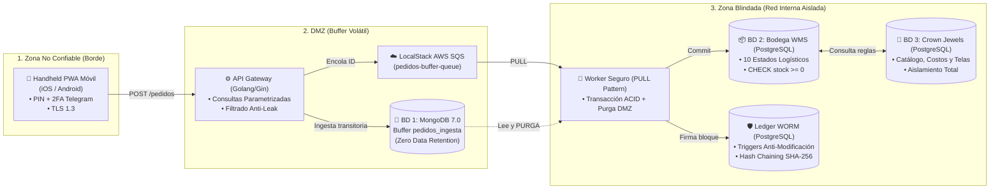

# 🛡️ Plataforma de Seguridad y Trazabilidad Textil — "Corte & Sastre"

[](https://www.docker.com/)
[](https://www.postgresql.org/)
[](https://www.mongodb.com/)
[](https://go.dev/)
[](https://localstack.cloud/)
[](https://owasp.org/)
[](https://www.iso.org/)

---

## 🏛️ Contexto Académico
* **Institución:** Universidad Mariano Gálvez de Guatemala (UMG)
* **Facultad:** Ingeniería en Sistemas de Información y Ciencias de la Computación
* **Curso:** Seguridad y Auditoría de Sistemas
* **Catedrático:** Ing. Omar Sagastume
* **Equipo de Trabajo:**
  * **Joshua Iván André Méndez Vásquez** (Líder Técnico & Auditor de Ciberseguridad)
  * **Esteban David Salic Mejía** (Arquitectura & Desarrollo)
  * **Elías Gregorio Marquirez** (Infraestructura & Operaciones)

---

## 👔 1. Modelo de Negocio y Segmento
**Corte & Sastre** es una empresa guatemalteca especializada en la **confección y distribución de camisería masculina de lujo y sastrería a medida (*Bespoke Tailoring*)**.
* **Segmento:** Sector corporativo de alta dirección, profesionales y diplomáticos en zonas comerciales prémium (Zona 10, Zona 14, Plaza Fontabella, Paseo Cayalá).
* **Canales:** Tiendas físicas, asesores de campo equipados con terminales móviles (*Handheld PWA*), y rutas de entrega con cobro contra entrega (*COD - Cash On Delivery*).
* **Activo Crítico (*Crown Jewels*):** Fichas técnicas de confección, fórmulas textiles (Lino Belga, Algodón Egipcio Giza 87), costos unitarios de importación y contratos confidenciales con tejedurías internacionales.

---

## 📐 2. Arquitectura de Tres Capas ("Zero Trust Data Tiering")



### Principios Fundamentales de Seguridad
1. **Flujo Unidireccional PULL:** La aplicación móvil y la DMZ jamás tienen acceso directo a la base de datos interna. El worker interno extrae información desde la DMZ hacia el núcleo seguro.
2. **Zero Data Retention en DMZ:** Los pedidos procesados en MongoDB son eliminados inmediatamente tras su registro en PostgreSQL, eliminando cualquier vector de acumulación perimetral.
3. **Ledger Inmutable WORM (*Write Once, Read Many*):** Triggers a nivel de kernel de PostgreSQL impiden sentencias `UPDATE` o `DELETE` sobre los logs de auditoría. Cada fila está encadenada matemáticamente por hash SHA-256:
   $$\text{Hash}_N = \text{SHA256}(\text{ID} + \text{Actor} + \text{Acción} + \text{Recurso} + \text{Payload} + \text{IP} + \text{Hash}_{N-1})$$
4. **Filtrado Anti-Data-Leak:** El backend omite deliberadamente los costos de producción y márgenes comerciales en las respuestas al dispositivo móvil.
5. **Autenticación Fuerte Fuera de Banda (2FA):** Código OTP numérico de 6 dígitos con entrega vía Telegram Bot API.

---

## 📂 3. Estructura del Repositorio

```text
├── backend/
│   ├── Dockerfile                 # Imagen multi-stage optimizada en Alpine Linux
│   ├── go.mod                     # Dependencias oficiales de Go
│   ├── main.go                    # API Gateway, worker asíncrono y control de 2FA
│   └── frontend/
│       ├── index.html             # Handheld PWA interactivo (Modo oscuro / bodeguero)
│       ├── app.js                 # Lógica de cliente, escáner de códigos y offline SW
│       ├── styles.css             # Estilos responsivos para terminales móviles
│       ├── sw.js                  # Service Worker de la PWA
│       ├── manifest.json          # Manifiesto de instalación nativa iOS / Android
│       ├── explorador.html        # Explorador visual Multi-BD (PostgreSQL, MongoDB, SQS)
│       └── auditoria.html         # Consola forense del Ledger WORM SHA-256
├── db/
│   └── init-scripts/
│       ├── 01_init_schemas_and_roles.sql   # Creación de esquemas y permisos
│       ├── 02_init_tables.sql              # Definición de tablas, llaves y triggers WORM
│       ├── 03_seed_data.sql                # Datos maestros base
│       └── 04_full_enterprise_data.sql     # Catálogo completo (25 SKUs, 8 proveedores, 10 telas, 19 despachos)
├── localstack/
│   └── init-aws.sh                # Script de aprovisionamiento de cola AWS SQS
├── docs/
│   └── ARQUITECTURA_SEGURIDAD.md  # Informe formal y mapeo de controles ISO 27001 / OWASP
├── docker-compose.yml             # Orquestador con red aislada bridge (cys_isolated_net)
├── .env.example                   # Plantilla de variables de entorno
└── .gitignore                     # Filtro de archivos para control de versiones
```

---

## 👥 4. Matriz de Control de Acceso (IAM & ACL)

| Código Empleado | Nombre | Rol | Sedes Autorizadas | PIN Acceso | 2FA Telegram |
| :---: | :--- | :--- | :--- | :---: | :---: |
| `8840219` | Joshua Méndez | Supervisor General & Auditor | Todas las sedes (Matriz, Z10, Miraflores, Cayalá) | `8840` | Requerido |
| `103` | Elías Marquirez | Jefe de Bodega Central | Bodega Central (Matriz) | `5678` | Requerido |
| `101` | Esteban Salic | Vendedor de Piso | Bodega Central, Zona 10 | `4321` | Requerido |
| `201` | Carlos Repartidor | Piloto Repartidor COD | Bodega Central, Rutas Metropolitanas | `9900` | Requerido |

---

## 🚀 5. Puesta en Marcha Rápida (Local)

### Requisitos Previos
* Docker y Docker Compose instalados.
* Git.

### Instalación
```bash
# 1. Clonar el repositorio
git clone https://github.com/JoshuaMzV/Corte-Sastre.git
cd Corte-Sastre

# 2. Configurar variables de entorno
cp .env.example .env

# 3. Levantar la infraestructura completa
docker compose up -d --build
```

### Accesos Locales
* 📱 **Handheld Móvil:** `http://localhost:8088/`
* 🗄️ **Explorador Multi-BD:** `http://localhost:8088/explorador`
* 🛡️ **Consola Forense WORM:** `http://localhost:8088/auditoria`

---

## 🔍 6. Verificación Criptográfica de Auditoría
Para comprobar matemáticamente que ningún registro ha sido manipulado:
```bash
docker exec -it cys_postgres_core psql -U postgres_admin -d corte_y_sastre_db -c "SELECT * FROM auditoria_core.verificar_integridad();"
```
**Resultado esperado:**
```text
 es_valido | registros_auditados | error_en_id 
-----------+---------------------+-------------
 t         |                  49 |            
(1 row)
```

---

## 📜 Licencia y Uso
Proyecto con fines exclusivamente educativos y de investigación para la Universidad Mariano Gálvez de Guatemala.
