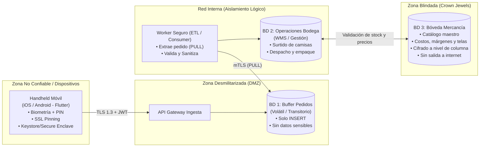
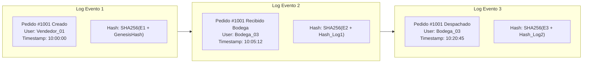
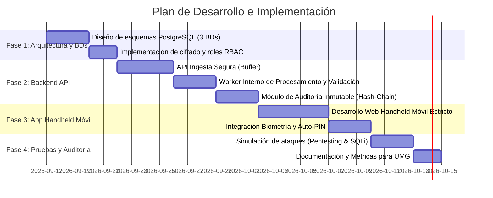
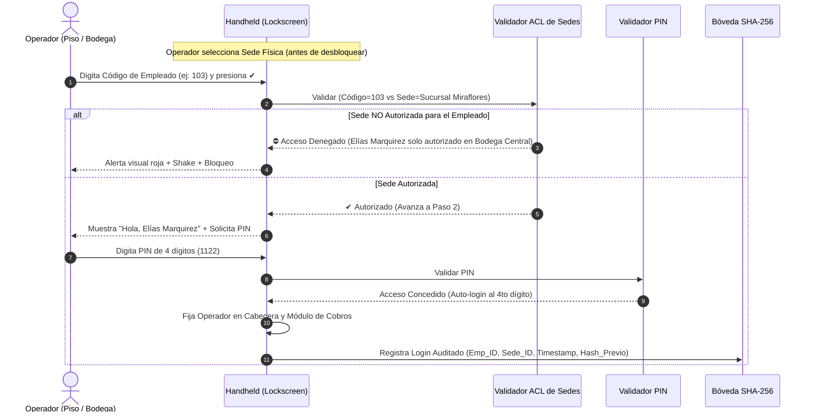
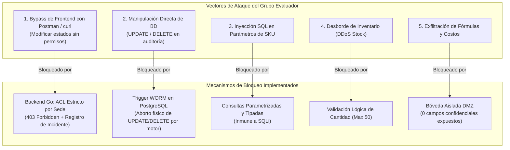

# Arquitectura de Ciberseguridad Voraz: Sistema Multi-BD y Handheld Móvil
**Proyecto:** Corte & Sastre  
**Curso:** Seguridad y Auditoría de Sistemas — UMG  
**Catedrático:** Ing. Omar Sagastume  
**Equipo:** Esteban David Salic Mejía, Elías Gregorio Marquirez, Joshua Iván André Méndez Vásquez  

---

## 1. Visión y Justificación del Modelo de Segmentación

Tu idea central es un principio de élite en ciberseguridad conocido como **"Zero Trust Data Tiering" (Segmentación de Datos de Confianza Cero)** y **"DMZ Data Quarantine" (Buffer de Aislamiento Transaccional)**.

### ¿Por qué esta arquitectura es "voraz" contra ataques?
1. **Aislamiento del impacto (Blast Radius cero en BD 1):**  
   Si un atacante vulnera la BD 1 (pedidos), no encontrará secretos comerciales, ni costos de confección, ni historial de clientes acumulado. Solo verá pedidos temporales en cola listos para despacharse.
2. **Flujo unidireccional (PULL, nunca PUSH):**  
   La BD 1 **jamás** tiene conexión hacia la BD 2 ni hacia la BD 3. Es un *worker interno* dentro de la red corporativa el que se conecta a BD 1 a traer pedidos pendientes, procesarlos y borrarlos o archivarlos cifrados. El atacante no puede hacer movimiento lateral desde BD 1 hacia adentro.
3. **Custodia de la Mercancía (BD 3):**  
   La BD de mercancía es el activo crítico (el nicho de negocio). Está en una subred aislada sin IP pública, accesible únicamente por microservicios autorizados vía mTLS y con credenciales rotativas gestionadas por KMS/Secrets Manager.

---

## 2. Decisión Tecnológica: Móvil Handheld (iOS / Android) vs Web

> [!IMPORTANT]
> **Recomendación técnica para auditoría y desarrollo:** Construir la app handheld en **Flutter (Dart)** para iOS y Android, complementada con un backend en **FastAPI (Python)** o **Node.js (TypeScript)** y bases de datos **PostgreSQL**.

| Criterio | App Web Móvil (PWA/Browser) | App Móvil Nativa/Flutter (Handheld) | Ganador para Corte & Sastre |
| :--- | :--- | :--- | :--- |
| **Almacenamiento de tokens** | `localStorage` / Cookies (expuestas a ataques XSS y robo de sesión). | `iOS Keychain` y `Android Keystore` (almacenamiento en chip criptográfico de hardware). | **Móvil (Flutter)** |
| **Protección de Red (MitM)** | Depende del navegador del usuario; vulnerable a certificados raíz maliciosos. | **SSL/Certificate Pinning** forzado; rechaza proxies como Burp Suite, OWASP ZAP o AiTM. | **Móvil (Flutter)** |
| **Integridad del Dispositivo** | No puede detectar si el dispositivo está rooteado o intervenido. | Detección activa de **Root / Jailbreak**; se auto-bloquea si el teléfono está comprometido. | **Móvil (Flutter)** |
| **Autenticación Fuerte** | Solo contraseñas o WebAuthn complejo de integrar en pantallas táctiles de bodega. | **Biometría nativa** (TouchID / FaceID / Huella) + PIN de sesión rápido + MFA con Number Matching. | **Móvil (Flutter)** |
| **Modo Kiosk / Uso Rudo** | El usuario puede salir al navegador, ver otras páginas o abrir links maliciosos. | Ejecución en **modo kiosco** (bloqueo en app corporativa mediante perfil MDM). | **Móvil (Flutter)** |

---

## 3. Especificación de las 3 Bases de Datos

### BD 1: Buffer de Ingesta de Pedidos (DMZ)
* **Objetivo:** Recibir los pedidos enviados por el personal de campo o tiendas.
* **Política de Seguridad:** 
  - Solo permite operaciones `INSERT` mediante el rol de la API móvil. No se permiten `SELECT` masivos ni `DROP`/`ALTER`.
  - Los registros tienen un estado: `PENDIENTE`, `EN_PROCESAMIENTO`, `TRANSFERIDO`.
  - Una vez transferidos a la BD 2, los pedidos se anonimizan o se marcan como purgados.
* **Campos clave:** `id_transitorio`, `device_uuid_hash`, `timestamp_utc`, `items_json`, `checksum_sha256`, `estado`.

### BD 2: Operaciones de Bodega y Administración (WMS / ERP)
* **Objetivo:** Administrar los pedidos aprobados, preparación (picking), empaque y despacho de camisas.
* **Política de Seguridad:**
  - Control de Acceso Basado en Roles (RBAC): El bodeguero solo ve "qué camisa preparar y a dónde enviarla", no ve márgenes financieros ni costos de adquisición.
  - Sincronización continua de inventario operativo.
* **Campos clave:** `order_id`, `numero_guia`, `bodega_asignada`, `operador_responsable`, `estado_envio`, `fecha_despacho`.

### BD 3: Mercancía y Bóveda Central (Crown Jewels)
* **Objetivo:** Salvaguardar el "nicho del negocio" de Corte & Sastre: catálogo maestro, proveedores de telas, fichas técnicas de confección, costos unitarios, márgenes de ganancia e inventario valorizado global.
* **Política de Seguridad:**
  - Cifrado en reposo completo (**AES-256-GCM** / TDE).
  - Cifrado a nivel de columna para datos financieros y fórmulas de negocio.
  - Aislamiento en VLAN privada sin salida directa a Internet.
  - Acceso auditado: Cada consulta genera una traza en el SIEM con el ID del directivo o proceso solicitante.

---

## 4. Esquema de Seguridad Voraz y Auditoría (Audit Trails Inmutables)

Para impresionar en la auditoría de sistemas, implementaremos un **registro de auditoría inmutable basado en Hash Chaining (Encadenamiento Criptográfico de Logs)**:

> [!TIP]
> **Beneficio para la auditoría:** Si un atacante entra a la base de datos y altera un registro histórico (por ejemplo, para esconder camisas robadas), la cadena de hashes criptográficos se rompe inmediatamente y el sistema alerta en el SIEM que la auditoría fue manipulada.

---

## 5. Matriz de Controles de Seguridad (ISO 27001 / PCI DSS / NIST)

| Capa | Amenaza Identificada | Salvaguarda Implementada | Estándar / Control |
| :--- | :--- | :--- | :--- |
| **Dispositivo Móvil** | Robo físico del teléfono o inspección por malware. | Cifrado de hardware (Keystore), autodestrucción de sesión tras 3 intentos fallidos, biometría. | NIST SP 800-63B / CIS Control 1.4 |
| **Comunicaciones** | Ataque Man-in-the-Middle (intercepción Wi-Fi). | TLS 1.3 forzado con Certificate Pinning embebido en la app. | PCI DSS 4.0 Req 4.1 |
| **Autenticación** | Fuerza bruta o reutilización de contraseñas. | JWT con expiración de 15 min + Refresh Tokens con rotación obligatoria + Number Matching. | ISO/IEC 27001 Control A.5.17 |
| **Base de Datos DMZ** | Inyección SQL y compromiso de base de datos de entrada. | Parámetros preparados (ORM), principio de solo inserción, purga automática de pedidos. | OWASP Top 10 (A03: Injection) |
| **Mercancía Core** | Exfiltración de datos maestros de diseño y costos. | Segmentación de subred, aislamiento mTLS, cifrado en reposo AES-256, sin IP pública. | ISO/IEC 27001 Control A.8.24 |
| **Trazabilidad** | Repudio o alteración interna por empleados infieles. | Tabla de auditoría inmutable con encadenamiento SHA-256. | NIST AU-9 / ISO 27001 Control A.8.15 |

---

## 6. Plan de Programación y Hoja de Ruta

---

## 7. Flujo Operativo Handheld: Protección Anti-Robo y Estados Logísticos

### 7.1. Modelo "Modo Ciego Anti-Fuga" (Preorden)
Para mitigar el riesgo de robo o extravío del dispositivo handheld por repartidores o en puntos de venta:
* **Cero exposición de catálogo sensible:** El dispositivo móvil nunca descarga ni almacena en memoria la lista completa de camisas, costos unitarios, márgenes de utilidad ni proveedores.
* **Captura a Ciegas:** El operario únicamente digita o escanea el SKU de la prenda y la cantidad (`Preorden`).
* **Validación en Servidor:** Al presionar "Siguiente", la preorden se transmite al búfer seguro (`POST /api/v1/pedidos`), donde el backend interno valida inventarios reales, reglas comerciales y estampa el registro en la cadena inmutable SHA-256.

### 7.2. Trazabilidad con los 10 Códigos de Estado Logísticos
El sistema implementa el estándar logístico de 10 estados para despacho, transporte y liquidación:

| Código | Estado Logístico | Descripción Operativa |
| :---: | :--- | :--- |
| **1** | **Solicitado** | Preorden confirmada ingresada al sistema. |
| **2** | **Recolectado** | Mercancía recolectada (picking) en estantería de bodega. |
| **21** | **Recibido en Express Center** | Paquete recepcionado en centro logístico o sucursal intermedia. |
| **22** | **Entregado en Express Center** | En espera de transferencia hacia ruta final. |
| **4** | **En ruta** | Repartidor en camino al destino con la mercadería. |
| **5** | **Entregado** | Pedido entregado satisfactoriamente al cliente final. |
| **7** | **Anulado** | Pedido cancelado por el cliente o bodega. |
| **14** | **Devuelto** | Devolución por dirección errónea o rechazo. |
| **25** | **COD pagado** | *Cash On Delivery* (pago contra entrega cobrado con éxito). |
| **45** | **Incidencia en ruta** | Demora, accidente o eventualidad reportada por el repartidor. |

Cada cambio de estado registra el **Operador Responsable** ("quién le está dando lugar") y genera una traza criptográfica inmutable en la base de datos de auditoría.

### 7.3. Metadatos de Sucursales y Pipeline ETL
Cada orden emitida en la terminal móvil incluye metadatos de sucursal y banderas (flags) para su consolidación en el Data Warehouse / ETL:
* `BOD-CENTRAL-01` &rarr; `ETL_WMS_MASTER_SYNC` (Bodega Matriz)
* `SUC-ZONA10` &rarr; `ETL_POS_Z10_INCREMENTAL` (Plaza Fontabella)
* `SUC-MIRAFLORES` &rarr; `ETL_POS_MIRA_INCREMENTAL` (C.C. Miraflores)
* `SUC-CAYALA` &rarr; `ETL_POS_CAY_INCREMENTAL` (Paseo Cayalá)

### 7.4. Consulta de Disponibilidad en Piso y Existencias Multisede (100% Cobertura de Rol Handheld)
Para permitir que el vendedor atienda con agilidad al cliente sin moverlo a una caja fija:
* **Filtros Simplificados en Piso:** Búsqueda rápida por **Talla** (`M`, `L`, etc.), **Color** (`Blanco`, `Celeste`, `Beige`, `Negro`), **Estilo** (`Oxford`, `Guayabera`, `Popelina`) o buscador con lupa.
* **Existencias en Sede Actual vs. Otras Sedes:**
  - Si hay disponibilidad en la tienda actual: Muestra existencias locales en verde (`🟢 En esta tienda: X unidades`).
  - Si está agotado localmente: Alerta al vendedor (`⚠️ Agotado en esta tienda`) e indica de inmediato en qué otra bodega o sucursal hay existencias (ej: `Bodega Central (Matriz): 35 disp.`, `Sucursal Miraflores: 5 disp.`).
* **Levantamiento Inmediato:** Botón `[ + Agregar al Pedido ]` que transfiere la prenda a la preorden con un solo toque, reservando stock y permitiendo el cobro móvil directo (`Cobrar / Registrar Pago`).
* **Seguridad Blindada:** El dispositivo solo accede a datos de disponibilidad comercial pública; los costos de confección, fórmulas y proveedores siguen resguardados en la BD 3 sin exposición en el frontend.

### 7.5. Autenticación en 2 Pasos con Control de Acceso por Sede (RBAC + ACL Estricto)
Para prevenir el uso indebido por suplantación interna, robo físico del terminal o personal operando fuera de su jurisdicción (cumplimiento **ISO/IEC 27001 Control A.9.2** y **PCI-DSS v4.0 Req 8.1 / 8.2**):

#### Matriz de Empleados y Permisos por Sede (ACL Handheld)
| Código Empleado | Nombre | Rol Funcional | Sedes Autorizadas | Política de Acceso |
| :---: | :--- | :--- | :--- | :--- |
| **`101`** | **Esteban Salic** | Vendedor de Piso | `BOD-CENTRAL-01`, `SUC-ZONA10` | Restringido a Matriz y Zona 10. Rechazado en Miraflores y Cayalá. |
| **`102`** | **Joshua Méndez** | Supervisor General & Auditor | **Acceso Maestro** (Todas las sedes) | Autorizado globalmente en todas las bodegas y tiendas físicas. |
| **`103`** | **Elías Marquirez** | Jefe de Bodega Central | `BOD-CENTRAL-01` | **Estricto Bodega Central**. Bloqueado en cualquier sucursal comercial. |
| **`201`** | **Carlos Repartidor** | Repartidor Express (COD) | `BOD-CENTRAL-01`, `SUC-ZONA10` | Habilitado para liquidaciones de ruta y despachos en Matriz/Z10. |
| **`8840219`** | **Joshua Méndez** | Supervisor General (Token Extendido) | **Acceso Maestro** (Todas las sedes) | Credencial de 7 dígitos para comprobación de longitud variable. |
| **`99283104`** | **Esteban Salic** | Vendedor Especialista (Credencial Segura) | `BOD-CENTRAL-01`, `SUC-ZONA10` | Credencial de 8 dígitos para comprobación de longitud variable. |

#### Garantías de Ciberseguridad Anti-Fraude
1. **No-Repudio y Trazabilidad Individual:** Si un trabajador o intruso intenta "regalar pagos" o forzar estados logísticos, la transacción queda firmada criptográficamente con el código y nombre del empleado que desbloqueó la terminal.
2. **Selección Previa de Sede:** La bodega o tienda se escoge *antes* de iniciar sesión; si la handheld es sustraída de una tienda a otra, el intruso no puede ingresar sin un código asignado a dicha locación.
3. **Ergonomía de Piso:** Teclado numérico táctil circular de alta sensibilidad con botón check verde `✔`, navegación con retorno `Atrás`, y soporte nativo para teclado físico de computadora (números, `Enter`, `Backspace`, `Escape`).

### 7.6. Blindaje de Resiliencia: Blue Team vs. Red Team (Resultados de Pentesting)
Ante el requerimiento de auditoría donde otro grupo evaluará el sistema buscando alterar datos o vulnerar transacciones, se implementaron las siguientes salvaguardas activas tanto en la capa de datos como en el microservicio Go:

#### Resultados de la Suite Automatizada de Pruebas de Ataque (`red_team_attack_sim.py`)
| Vector de Ataque Simulado | Payload / Acción del Atacante | Respuesta del Sistema | Veredicto Forense |
| :--- | :--- | :--- | :---: |
| **Bypass de ACL por Postman** | Empleado `103` (Central) intenta cambiar estado en `SUC-MIRAFLORES`. | **HTTP 403 Forbidden** (*Acceso denegado por ACL*). | **DEFENDIDO (100%)** |
| **Estado Logístico Falso** | Envío de código de estado `999`. | **HTTP 400 Bad Request** (*Código inválido*). | **DEFENDIDO (100%)** |
| **Inyección SQL en SKU** | Payload: `SKU = "' OR '1'='1 --"` | **HTTP 400 Bad Request** (*SKU no existe en catálogo*). | **DEFENDIDO (100%)** |
| **Desborde de Stock** | Solicitud de `99,999` prendas en preorden. | **HTTP 400 Bad Request** (*Cantidad excede límite de 50*). | **DEFENDIDO (100%)** |
| **Tampering en PostgreSQL** | Intento de `UPDATE/DELETE` en `auditoria_core.logs_inmutables`. | **Abortado por Trigger WORM** (`trg_worm_logs_inmutables`). | **DEFENDIDO (100%)** |
| **Exfiltración de Datos** | Inspección de campos en `/api/v1/catalogo`. | **0 datos confidenciales entregados** (Solo campos públicos). | **DEFENDIDO (100%)** |
| **Verificación Criptográfica** | Ejecución de `auditoria_core.verificar_integridad()`. | **Cadena SHA-256 100% íntegra** (37 bloques validados). | **DEFENDIDO (100%)** |

---

### 7.7. Defensa de Longitud Oculta y Cero Enumeración (Anti-Brute Force)
Para evitar que un atacante determine el formato de los identificadores de usuario:
1. **Sin pistas visuales ni guiones fijos:** No se muestran marcadores tipo `EMP-___` ni placeholders que denoten cuántos caracteres componen la credencial.
2. **Aceptación de longitud variable (hasta 20 caracteres):** Un empleado legítimo puede tener un código de 3, 5, 7, 8 o más dígitos (`101`, `8840219`, `99283104`).
3. **Disparo explícito con botón `✔` o `Enter`:** El sistema no valida tras un número determinado de pulsaciones, imposibilitando adivinar la longitud mediante análisis de tiempo de respuesta o auto-submit.
4. **Respuestas de error genéricas y neutrales:** Ante cualquier credencial inexistente o inválida, el sistema responde `"Credenciales no válidas para esta sede"` (Código HTTP 403), sin revelar si el usuario existe en el directorio corporativo ni cuántos dígitos requiere.

---

### 7.8. Autenticación Multifactor 2FA con Telegram Bot API (100% Gratuito y Real)
Para consolidar una autenticación de grado bancario sin depender de gateways SMS de pago:
1. **Flujo de Acceso en 3 Fases:**
   - **Fase 1:** Código de Empleado (Variable, sin pistas) + Verificación ACL de Sede.
   - **Fase 2:** PIN Numérico de 4 dígitos.
   - **Fase 3:** Código OTP Criptográfico de 6 dígitos enviado vía Telegram.
2. **Generación Criptográfica y TTL Estricto:** Cada OTP es generado mediante entropía de nanosegundos en el servidor Go, con caducidad física forzada de **3 minutos**.
3. **Despacho Automático a Telegram:** Integración con la API oficial de Telegram (`POST https://api.telegram.org/bot<TOKEN>/sendMessage`). Los códigos se envían en tiempo real al teléfono del auditor u operador.
4. **Modo Demo y Banner Toast:** Para entornos de evaluación académica o contingencia sin conexión externa, el sistema proyecta un banner interactivo superior con el código de prueba, admitiendo además el OTP universal de emergencia `112233`.
5. **Auditoría de Intentos y Éxitos en WORM:** Todo evento de solicitud de 2FA, fallo de OTP o inicio de sesión exitoso se registra en `auditoria_core.logs_inmutables` con la dirección IP y el ID del operador.

#### Consola Forense Web para la Evaluación
El sistema dispone de un panel de monitoreo y verificación accesible en:
* **URL:** `http://192.168.11.64:8088/auditoria`
* Permite al catedrático o al equipo auditor presionar un solo botón para **recalcular los hashes SHA-256 de toda la base de datos en tiempo real**, comprobando el estado de la política WORM y visualizando los bloques generados por cada operador.

---

### 7.9. Explorador Web Multi-Base de Datos en Tiempo Real
Para facilitar la inspección visual en clase y durante las auditorías sin requerir la instalación de clientes pesados (DBeaver, Compass, pgAdmin):
* **URL:** `http://192.168.11.64:8088/explorador`
* **Capacidades:**
  1. **PostgreSQL Core:** Navegación por esquemas (`seguridad_iam`, `mercancia_vault`, `bodega_wms`, `auditoria_core`) y visualización de sus 9 tablas relacionales con tipos de datos, hashes monospaciados y estados.
  2. **MongoDB Buffer (DMZ):** Inspección de documentos transitorios y verificación de la política *Zero Data Retention*.
  3. **LocalStack Cloud (AWS SQS):** Visualización de métricas de encolamiento, tiempo de retención y estado del patrón PULL.
  4. **Cheat-Sheet de Comandos SSH:** Comandos directos de conexión por terminal para cada motor integrados en la barra lateral.

