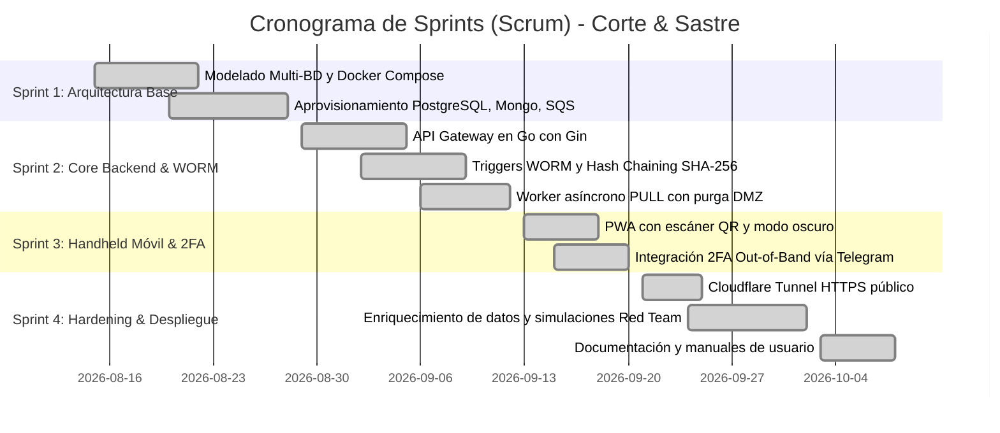

# 📘 Documentación Técnica del Sistema — "Corte & Sastre"
## Metodología Ágil (Scrum) y Especificación de Ingeniería de Software

**Proyecto:** Plataforma Blindada de Gestión Logística y Trazabilidad Textil  
**Curso:** Seguridad y Auditoría de Sistemas — Universidad Mariano Gálvez de Guatemala  
**Catedrático:** Ing. Omar Sagastume  
**Equipo de Desarrollo (Scrum Team):**
* **Product Owner & Auditor de Ciberseguridad:** Joshua Iván André Méndez Vásquez
* **Scrum Master & Arquitecto de Software:** Esteban David Salic Mejía
* **Lead DevOps & Cloud Infrastructure:** Elías Gregorio Marquirez

---

## 1. Marco Metodológico Ágil (Scrum Framework)

El proyecto se ejecutó bajo la metodología ágil **Scrum**, adaptada a ciclos rápidos de iteración orientados a la ciberresiliencia y cumplimiento de normativas de auditoría de sistemas (ISO 27001 y OWASP API Security).

### 1.1 Roles del Equipo Scrum
* **Product Owner (PO):** Define la visión del producto, prioriza el Product Backlog según el impacto en la seguridad del negocio y valida la entrega de valor con el catedrático.
* **Scrum Master (SM):** Facilita las ceremonias ágiles, elimina bloqueos técnicos en el despliegue de contenedores y asegura la adherencia a buenas prácticas de código limpio y parametrización segura.
* **Development Team:** Diseña los esquemas segregados, implementa los microservicios en Go, desarrolla la PWA móvil y configura los túneles seguros y bases de datos.

### 1.2 Definición de Hecho (Definition of Done - DoD)
Una Historia de Usuario se considera **completada (Done)** únicamente cuando:
1. El código fuente está libre de inyección SQL (consultas 100% parametrizadas con sentencias preparadas).
2. Los datos confidenciales de costos y proveedores están filtrados en el backend (*Anti-Data-Leak*).
3. Todas las transacciones críticas generan un bloque inmutable firmado en el ledger WORM (`auditoria_core.logs_inmutables`).
4. La función matemática `auditoria_core.verificar_integridad()` confirma `es_valido = true`.
5. Se despliega y prueba satisfactoriamente en contenedores Docker y en la terminal móvil Handheld vía HTTPS.

---

## 2. Planificación de Sprints y Product Backlog

El desarrollo se estructuró en **4 Sprints de 1 a 2 semanas**:



---

## 3. Historias de Usuario Principales (User Stories)

### HU-01: Ingesta Perimetral Segura de Pedidos (DMZ)
* **Como:** Asesor de sastrería en campo.
* **Quiero:** Registrar pedidos desde el Handheld móvil sin conectarme directamente a la base de datos central.
* **Para:** Agilizar la atención al cliente sin poner en riesgo la red interna de la empresa.
* **Criterios de Aceptación:**
  * La preorden se envía vía POST `/api/v1/pedidos` cifrada con TLS 1.3.
  * Los datos se depositan temporalmente en MongoDB (`pedidos_buffer.pedidos_ingesta`).
  * Un mensaje con el ID del pedido se encola en AWS SQS (`pedidos-buffer-queue`).
  * El worker interno procesa el despacho y purga inmediatamente el documento de MongoDB (*Zero Data Retention*).

### HU-02: Doble Factor de Autenticación Fuera de Banda (2FA Telegram)
* **Como:** Oficial de seguridad y auditor.
* **Quiero:** Que el inicio de sesión en dispositivos compartidos exija validación fuera de banda.
* **Para:** Impedir accesos no autorizados en caso de extravío o robo del Handheld.
* **Criterios de Aceptación:**
  * El operador ingresa su Código de Empleado y PIN numérico.
  * El servidor genera un OTP aleatorio de 6 dígitos con vigencia de 3 minutos.
  * El código se envía exclusivamente al Telegram del operador vía Bot API.
  * La respuesta HTTP de la app jamás incluye el código OTP en texto plano.

### HU-03: Trazabilidad Forense Inmutable (Ledger WORM)
* **Como:** Auditor de sistemas.
* **Quiero:** Que toda creación de pedido, cambio de estado logístico o cobro quede sellado criptográficamente.
* **Para:** Garantizar el no repudio y detectar cualquier intento de alteración manual en bodega.
* **Criterios de Aceptación:**
  * Cada registro calcula su hash: $\text{SHA256}(\text{datos} + \text{hash\_previo})$.
  * Triggers a nivel de PostgreSQL bloquean cualquier sentencia `UPDATE` o `DELETE`.
  * La función `auditoria_core.verificar_integridad()` valida la cadena completa e identifica cualquier bloque corrompido.

### HU-04: Gestión de Despachos con 10 Estados Logísticos
* **Como:** Jefe de bodega y repartidor.
* **Quiero:** Administrar la transición de las órdenes a lo largo del ciclo de vida de entrega.
* **Para:** Tener visibilidad en tiempo real del inventario y liquidar cobros contra entrega (COD).
* **Criterios de Aceptación:**
  * Soporta los 10 estados oficiales: *Solicitado (1), Recolectado (2), En ruta (4), Entregado (5), Anulado (7), Devuelto (14), Recibido en Express Center (21), Entregado en Express Center (22), COD pagado (25), Incidencia en ruta (45)*.
  * Cada transición actualiza el stock con aislamiento ACID y registra el evento en auditoría.

---

## 4. Stack Tecnológico y Dependencias

| Componente | Tecnología | Versión | Propósito en la Arquitectura |
| :--- | :--- | :---: | :--- |
| **Backend API** | Golang (Gin Framework) | 1.22 | Microservicio de alto rendimiento, routing seguro y worker PULL asíncrono. |
| **BD Operativa / Bóveda** | PostgreSQL | 16-alpine | Almacenamiento relacional con 4 esquemas (`seguridad_iam`, `mercancia_vault`, `bodega_wms`, `auditoria_core`). |
| **Buffer NoSQL** | MongoDB | 7.0 | Buffer transitorio perimetral en DMZ (*Zero Data Retention*). |
| **Cloud Emulado** | LocalStack AWS | 3.0 | Emulación local de AWS SQS, KMS, S3 y Secrets Manager. |
| **Frontend Móvil** | Vanilla HTML5 / CSS3 / ES6 | PWA | Handheld ultra-liviano, responsivo, modo oscuro y cámara QR integrada. |
| **Túnel Seguro** | Cloudflare Tunnel | cloudflared | Publicación perimetral con TLS 1.3 sin abrir puertos entrantes en el firewall. |
| **Criptografía** | pgcrypto / crypto/sha256 | Nativo | Generación de Hashes SHA-256 para encadenamiento de bloques WORM. |

---

## 5. Pruebas y Aseguramiento de Calidad (QA)

### 5.1 Pruebas de Inyección SQL (Anti-SQLi)
Se realizaron pruebas de fuzzing inyectando payloads como `' OR '1'='1` y `'; DROP TABLE...` en parámetros de búsqueda y login. Todas las consultas utilizan sentencias preparadas nativas en Go (`$1`, `$2`), neutralizando cualquier vector de inyección a nivel de driver relacional.

### 5.2 Pruebas de Resiliencia del Ledger WORM
Se ejecutó un ataque simulado como superusuario `postgres_admin`:
```sql
DELETE FROM auditoria_core.logs_inmutables WHERE id = 1;
-- Resultado: ERROR: [SEGURIDAD CRÍTICA] Violación de Inmutabilidad WORM. Transacción abortada.
```

### 5.3 Pruebas de Concurrencia en Stock
Simulación de órdenes simultáneas sobre la última unidad disponible. La restricción `CHECK (cantidad_disponible >= 0)` combinada con transacciones `SERIALIZABLE / READ COMMITTED` impidió discrepancias o inventario negativo en bodega.
