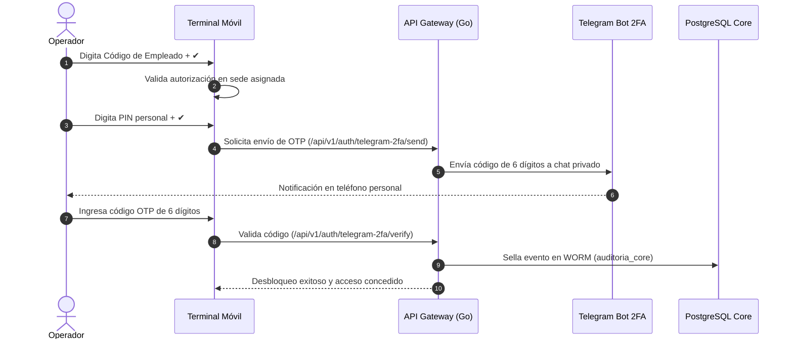

# 📱 Manual de Usuario del Sistema — "Corte & Sastre"
## Guía Operativa de la Terminal Móvil (Handheld PWA) y Consolas de Auditoría

**Plataforma:** Sistema de Gestión y Trazabilidad de Camisería de Lujo  
**Versión:** 2.0 (Despliegue Multi-BD y Ciberseguridad)  
**Entorno de Acceso Público:** [https://api-corte.tld-list.lat/](https://api-corte.tld-list.lat/)  
**Destinatarios:** Asesores comerciales en tienda y campo, jefes de bodega, motoristas repartidores y auditores de sistemas.

---

## 📑 Tabla de Contenidos
1. [Instalación en Dispositivos Móviles (PWA)](#1-instalación-en-dispositivos-móviles-pwa)
2. [Flujo de Autenticación de Tres Pasos (IAM + 2FA)](#2-flujo-de-autenticación-de-tres-pasos-iam--2fa)
3. [Módulo 1: Registro de Preórdenes en Campo](#3-módulo-1-registro-de-preórdenes-en-campo)
4. [Módulo 2: Consulta de Disponibilidad en Piso](#4-módulo-2-consulta-de-disponibilidad-en-piso)
5. [Módulo 3: Operaciones de Bodega y Cobro COD](#5-módulo-3-operaciones-de-bodega-y-cobro-cod)
6. [Bloqueo de Terminal y Seguridad de Turno](#6-bloqueo-de-terminal-y-seguridad-de-turno)
7. [Consolas de Inspección y Auditoría Multi-BD](#7-consolas-de-inspección-y-auditoría-multi-bd)

---

## 1. Instalación en Dispositivos Móviles (PWA)

La aplicación fue desarrollada como una **Progressive Web App (PWA)**, lo que permite ejecutarla a pantalla completa nativa sin necesidad de descargar archivos APK ni configuraciones complejas de perfiles iOS.

### En iPhone (Apple iOS - Safari):
1. Abre el navegador **Safari** e ingresa a: `https://api-corte.tld-list.lat/`
2. Presiona el botón **Compartir** (icono de cuadrado con flecha hacia arriba en la barra inferior).
3. Desplázate hacia abajo y selecciona **"Agregar a pantalla de inicio"** (*Add to Home Screen*).
4. Confirma el nombre **"C&S Handheld"** y presiona **Agregar**.
5. La app se abrirá en modo pantalla completa sin barra de navegación, con soporte de cámara y vibración táctil.

### En Dispositivos Android (Google Chrome):
1. Abre **Google Chrome** e ingresa a: `https://api-corte.tld-list.lat/`
2. En la parte inferior aparecerá un mensaje emergente: *"Agregar Corte & Sastre a la pantalla principal"*. Si no aparece, toca el menú de tres puntos (arriba a la derecha) y pulsa **"Instalar aplicación"**.
3. Se generará un acceso directo en tu cajón de aplicaciones exactamente igual a una app de la Play Store.

---

## 2. Flujo de Autenticación de Tres Pasos (IAM + 2FA)

Para cumplir con la norma **ISO/IEC 27001**, el acceso a las terminales de campo implementa autenticación robusta fuera de banda:

### Paso a Paso para Iniciar Sesión:
1. **Paso 1 - Código de Empleado:**
   * Toca la pantalla de bloqueo o presiona el botón central **"Ingresar al Sistema"**.
   * Usa el teclado numérico para escribir tu código de empleado asignado.
   * Presiona el botón verde de verificación (**✔**).
2. **Paso 2 - PIN Numérico Personal:**
   * Verás tu nombre y puesto en pantalla.
   * Digita tu clave numérica. *(Por seguridad, la pantalla no revela cuántos dígitos tiene tu PIN ni avanza automáticamente)*.
   * Presiona el botón verde (**✔**) para confirmar.
3. **Paso 3 - Verificación 2FA por Telegram:**
   * El sistema genera un código OTP numérico de 6 dígitos válido por 3 minutos.
   * Recibirás un mensaje privado del bot oficial **`@cys_seguridad_joshua_bot`** en Telegram con el formato:
     > 🛡️ **[CORTE & SASTRE - VERIFICACIÓN 2FA]**  
     > 👤 **Operador:** Joshua Méndez  
     > 🔑 **Código de Acceso:** `884021`  
     > ⏱️ **Válido por:** 3 minutos.
   * Digita los 6 dígitos en el teclado del Handheld. La terminal se desbloqueará automáticamente al ingresar el sexto dígito.

> [!NOTE]
> **Cambio de Sede:** Si eres un supervisor con credencial extendida autorizada para múltiples sucursales, puedes tocar la etiqueta de la sede en la parte superior para seleccionar entre *Bodega Central, Fontabella, Miraflores o Paseo Cayalá*.

---

## 3. Módulo 1: Registro de Preórdenes en Campo

Ubicado en la pestaña **"Preorden"** (icono de documento con signo más):

1. **Datos del Cliente:**
   * Completa el nombre del cliente o empresa (ej. *Bufete Jurídico Méndez & Asociados*).
   * Ingresa la dirección exacta de entrega en la Ciudad de Guatemala.
2. **Selección y Escaneo de Prendas:**
   * **Opción A (Cámara QR):** Presiona el botón azul **"Escanear"**. Se abrirá el visor de cámara; apunta al código QR de la camisa para añadirla automáticamente al pedido.
   * **Opción B (Catálogo Rápido):** Toca cualquiera de las tarjetas de sugerencia rápida (ej. *CYS-OXF-BLA-M*, *CYS-LIN-BLA-L*).
   * **Opción C (Manual por SKU):** Escribe el código SKU exacto en el campo de texto, indica la cantidad deseada y presiona el botón verde **(+)**.
3. **Revisión y Transmisión Segura:**
   * La lista inferior mostrará las prendas agregadas con opción de eliminar ítems si te equivocaste.
   * En la caja de resumen final, pulsa **"ENVIAR Y GENERAR ORDEN [ESTADO 1: SOLICITADO]"**.
   * El pedido se transmitirá de forma segura a la DMZ perimetral y el worker interno lo sincronizará en bodega sin riesgo de fuga de datos.

---

## 4. Módulo 2: Consulta de Disponibilidad en Piso

Ubicado en la pestaña **"Disponibilidad"** (icono de lupa):

1. **Buscador en Tiempo Real:** Escribe en la barra superior cualquier palabra clave (ej. *lino, celeste, M, 45, oxford*). La lista filtra instantáneamente.
2. **Filtros por Categoría:**
   * **Estilo:** *Todos, Oxford, Guayabera, Popelina*.
   * **Talla:** *Todas, M, L*.
   * **Color:** *Todos, Blanco, Celeste, Beige, Negro*.
3. **Detalle de Existencias:**
   * Cada tarjeta muestra el precio de venta al público en quetzales (Q), la talla, el modelo y el stock disponible.
   * Se detalla la existencia en la sede actual y en las demás sucursales de la empresa.
   * Puedes presionar el botón verde **(+)** en cualquier prenda para transferirla de inmediato a tu carrito de preorden.

---

## 5. Módulo 3: Operaciones de Bodega y Cobro COD

Ubicado en la pestaña **"Bodega"** (icono de camión de reparto):

### Gestión del Ciclo de Vida Logístico (10 Estados):
1. **Filtros por Estado:** Puedes visualizar órdenes filtrando por:
   * *Todos, Solicitado (1), Recolectado (2), En ruta (4), Entregado (5), Anulado (7), Devuelto (14), Recibido en Express Center (21), Entregado en Express Center (22), COD pagado (25), Incidencia en ruta (45)*.
2. **Cambio de Estado:**
   * Pulsa el botón azul **"Cambiar Estado"** en cualquier orden.
   * Selecciona el nuevo estado logístico aplicable.
   * Confirma el nombre del operador responsable y presiona **"Guardar Estado"**.
   * La transacción actualiza el inventario en tiempo real y sella el cambio en el ledger inmutable WORM.

### Módulo de Cobro Contra Entrega (COD):
1. Cuando una orden se encuentra lista para cobro, presiona el botón verde **"Cobro (COD)"**.
2. **Seleccionar Ubicación:** *Tienda Física / Caja* o *Reparto a Domicilio (Ruta COD)*.
3. **Seleccionar Método de Pago:**
   * 💵 **Efectivo (Cash)**
   * 💳 **Tarjeta POS**
   * 🏦 **Transferencia Bancaria**
4. Verifica el monto y pulsa **"Confirmar y Registrar Pago"**. La orden pasará inmediatamente al estado **[25] COD pagado** y quedará firmada con SHA-256 para conciliación contable.

---

## 6. Bloqueo de Terminal y Seguridad de Turno

Para evitar que personal no autorizado use una terminal abierta:
* En cualquier momento, presiona el **icono del candado** en la esquina superior derecha del encabezado.
* La aplicación se cerrará de inmediato, ocultando datos de clientes y órdenes, y regresará a la pantalla de bloqueo protegida por PIN y 2FA.

---

## 7. Consolas de Inspección y Auditoría Multi-BD

Para supervisores, gerentes y auditores externos, la plataforma provee dos herramientas web especializadas:

### 🗄️ Explorador Multi-BD Visual
* **URL:** [https://api-corte.tld-list.lat/explorador](https://api-corte.tld-list.lat/explorador)
* **Funcionalidad:** Permite consultar visualmente todas las tablas de los 4 esquemas de PostgreSQL (`empleados_acl`, `camisas_catalogo`, `stock_inventario`, `ordenes_despacho`, etc.), la colección `pedidos_ingesta` en MongoDB y los atributos de la cola SQS de AWS.

### 🛡️ Consola Forense de Auditoría WORM
* **URL:** [https://api-corte.tld-list.lat/auditoria](https://api-corte.tld-list.lat/auditoria)
* **Funcionalidad:** Muestra el libro de registro criptográfico en vivo con cada bloque SHA-256, marca de tiempo UTC, actor e IP.
* **Botón de Verificación Matemática:** Al pulsar **"Verificar Integridad SHA-256"**, el motor recorre toda la cadena matemática y confirma el estado:
  $$\text{Resultado: } \mathbf{es\_valido = true} \quad (\text{49 Bloques Auditados})$$
